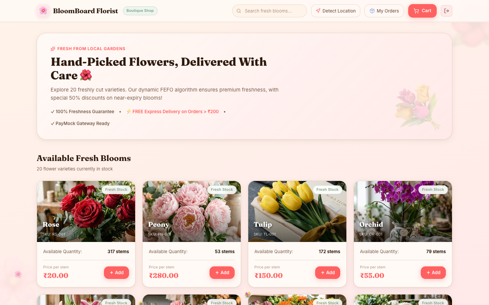
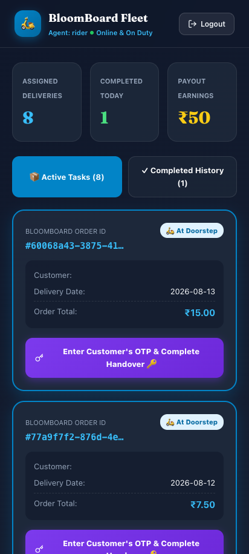
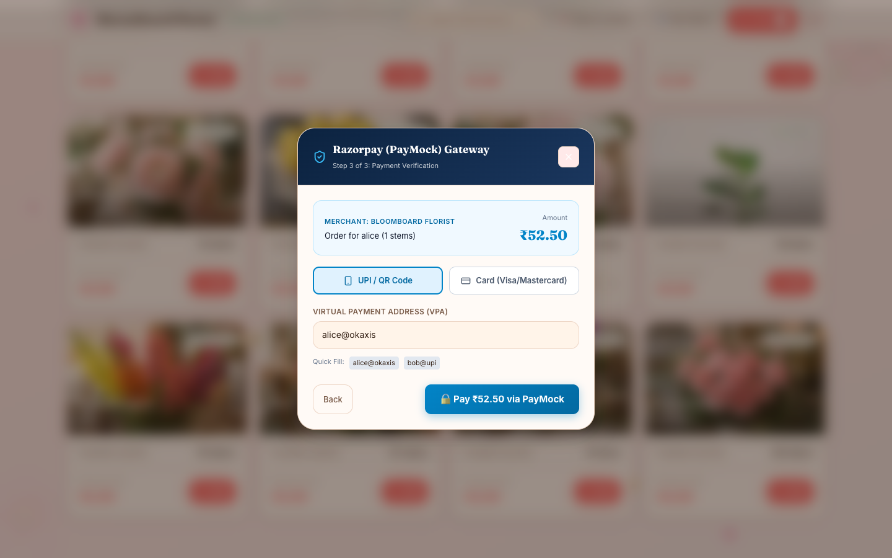
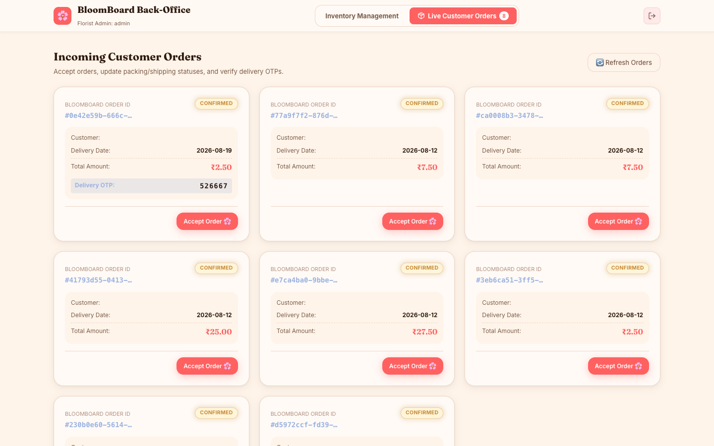
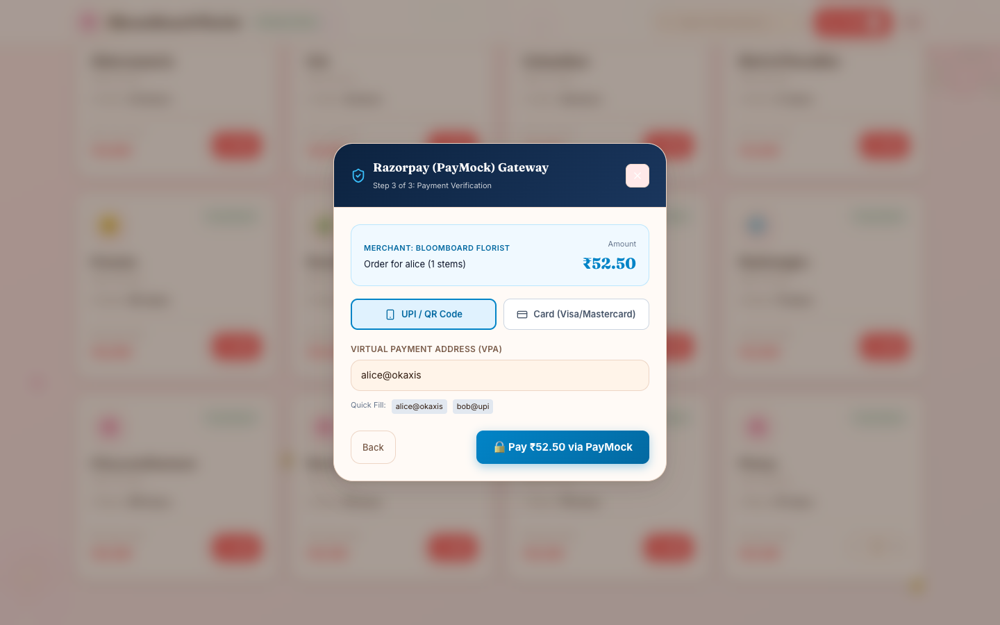

<p align="center">
  
</p>

<h1 align="center">🌸 BloomBoard</h1>

<p align="center">
  <strong>Perishable Inventory, Zomato-Style Delivery & E-Commerce Platform for Florists, Riders, and Customers</strong>
</p>

<p align="center">
  
  
  
  
  
  
</p>

---

## 🌐 Live Demo

- **Frontend (Vercel)**: [https://bloom-board-omega.vercel.app/](https://bloom-board-omega.vercel.app/)
- **Backend API (Render)**: [https://bloomboard-ezlh.onrender.com/](https://bloomboard-ezlh.onrender.com/)

> **Note:** The backend is hosted on a free-tier Render instance. If it has been inactive for a while, it may take 30–60 seconds to wake up when you first visit the site.

---

BloomBoard is a full-stack, production-ready floral inventory and order management platform designed specifically for time-sensitive, perishable inventory and instant delivery. It features a tri-role architecture:

1. **Customer Flower Shop Storefront** (`ROLE_CUSTOMER`): A boutique storefront featuring 20 fresh flower varieties priced according to authentic Pune flower market rates, stock availability, 50% discount tags on near-expiry blooms, PayMock payment checkout, and live Zomato-style doorstep OTP notifications.
2. **Florist Admin Management Portal** (`ROLE_ADMIN`): A back-office dashboard for florists to track batch expirations via FEFO, receive new shipments, record waste, and dispatch customer orders.
3. **Delivery Partner Fleet App** (`ROLE_DELIVERY`): A mobile-optimized portal for delivery partners to manage active dispatches, trigger doorstep OTP alerts when arriving at customer locations, and complete handovers via 6-digit OTP verification.

---

## 📸 Screenshots & Workflow

### 🌸 Customer Flower Storefront (`ROLE_CUSTOMER`)


Customers browse live flower stock with botanical photography, Pune market pricing (Roses ₹20, Peonies ₹280, Tulips ₹150), freshness badges, and 50% discount tags.

### 🛵 Delivery Partner Fleet App (`ROLE_DELIVERY`)


Mobile-first portal for delivery executives (`rider` / `password`) featuring assigned tasks, doorstep arrival triggers, and earnings trackers.

### 📦 Customer "My Orders" & Zomato-Style Doorstep OTP Card


Order tracker displaying a 4-stage visual timeline (`Confirmed` ➔ `Packing` ➔ `Out for Delivery` ➔ `Delivered`) along with live Doorstep OTP alerts when the rider arrives.

### 💐 Florist Live Orders Panel (`ROLE_ADMIN`)


Florist back-office panel to accept orders (`Accept Order 🌸`), mark packed (`Mark Packed 📦`), and dispatch shipments (`Dispatch / Ship 🚚`).

### 💳 PayMock Payment Gateway


Interactive payment gateway modal connected directly to PayMock server (`http://localhost:5001/api/payments`) supporting instant UPI (`alice@okaxis`) and Credit/Debit Card verification.

---

## 🔑 Login Credentials

| Role | Username | Password | Access |
|---|---|---|---|
| **Florist Admin** | `admin` | `password` | Florist Inventory & Orders Management Portal |
| **Delivery Agent** | `rider` | `password` | BloomBoard Fleet Mobile App |
| **Customer** | `alice` | `password` | Customer Flower Shop Storefront |
| **Customer** | `bob` | `password` | Customer Flower Shop Storefront |

---

## ✨ Core Features

| Feature | Description |
|---|---|
| **Tri-Role System** | Dedicated UIs for Customers (`CustomerApp.jsx`), Florist Admins (`FloristApp.jsx`), and Delivery Partners (`DeliveryApp.jsx`) |
| **FEFO Allocation Engine** | Automatically allocates stock using First-Expired-First-Out logic to minimize floral waste |
| **Zomato-Style Doorstep OTP** | OTP is only revealed on customer's screen when rider triggers doorstep arrival; rider enters customer's OTP to confirm handover |
| **Pune Market Pricing** | 20 flower varieties pre-loaded with authentic Pune flower market prices (Gultekdi rates) |
| **Atomic Checkout** | PostgreSQL transaction + Redis reservation prevents overselling under heavy concurrency |
| **Dynamic Discounting** | Batches expiring within 48 hours are automatically flagged (`isDiscounted: true`), giving customers 50% OFF |
| **JWT Security** | Stateless authentication using Spring Security + JWTs with role claims (`ROLE_ADMIN`, `ROLE_DELIVERY`, `ROLE_CUSTOMER`) |

---

## 🏗️ Architecture

```
                       ┌─────────────────────────┐
                       │      Login Screen       │
                       └────────────┬────────────┘
                                    │ JWT Auth
             ┌──────────────────────┼──────────────────────┐
             ▼                      ▼                      ▼
┌────────────────────────┐┌───────────────────┐┌────────────────────────┐
│  Customer Storefront   ││Florist Admin Panel││ Delivery Executive App │
│    (ROLE_CUSTOMER)     ││   (ROLE_ADMIN)    ││    (ROLE_DELIVERY)     │
└────────────┬───────────┘└─────────┬─────────┘└───────────┬────────────┘
             │                      │                      │
             └──────────────────────┼──────────────────────┘
                                    │ REST API
                      ┌─────────────▼─────────────┐
                      │ Spring Boot 3 (Port 8080) │
                      │  InventoryService (FEFO)  │
                      │  OrderService & Doorstep  │
                      └─────────────┬─────────────┘
                                    │
                        ┌───────────┴───────────┐
                        ▼                       ▼
                 ┌──────────────┐        ┌──────────────┐
                 │  PostgreSQL  │        │    Redis     │
                 └──────────────┘        └──────────────┘
```

---

## 🚀 Getting Started

### 1. Prerequisites
- Docker & Docker Compose
- Java 21 JDK
- Node.js 18+ & npm

### 2. Start Database & Redis
```bash
docker compose up -d
```

### 3. Run Backend
```bash
cd backend
./mvnw spring-boot:run
```

### 4. Run Frontend
```bash
cd frontend
npm install
npm run dev
```

Navigate to `http://localhost:5173` to log in as `admin`, `rider`, or `alice`!

---

## 📄 License

MIT License — built with ❤️ for florists, riders, and flower lovers everywhere.
