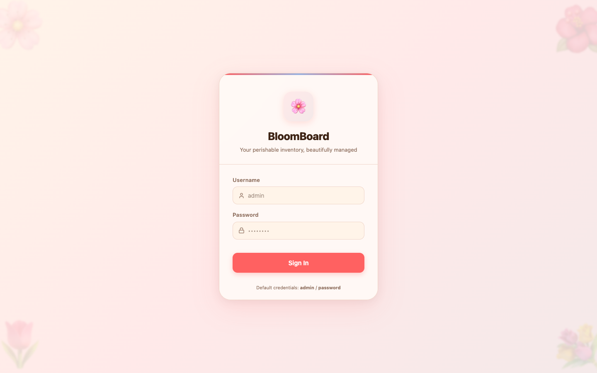
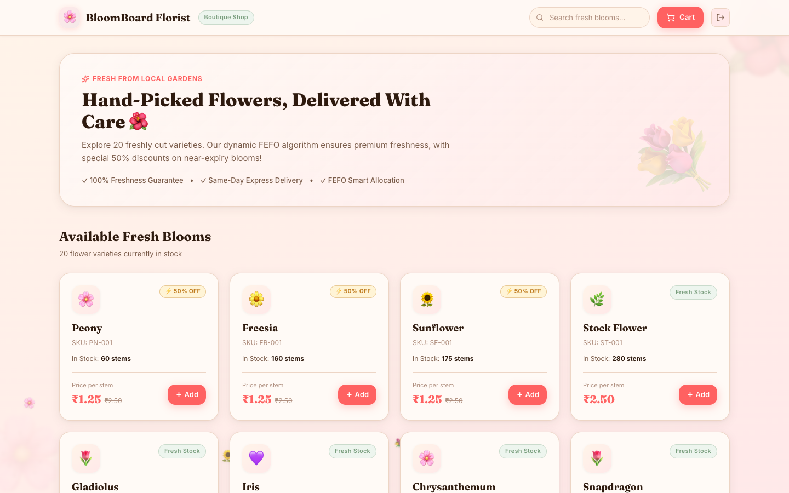
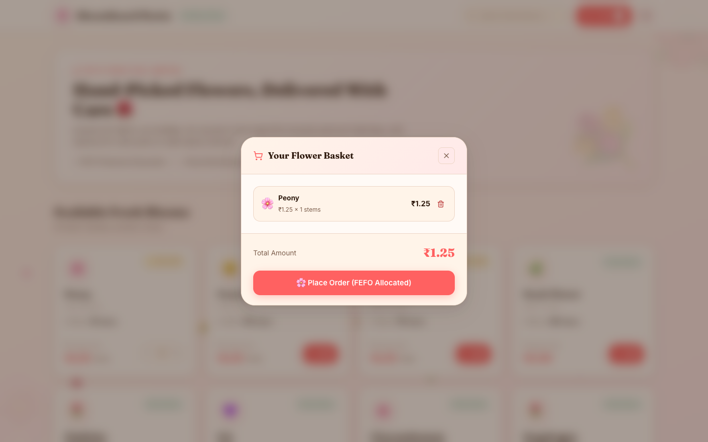
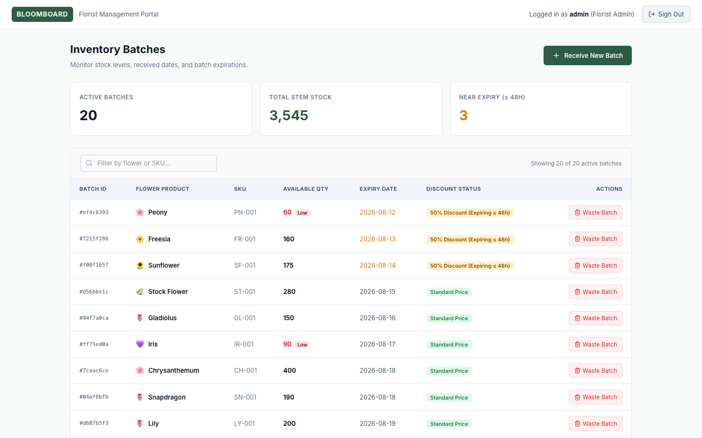

<p align="center">
  
</p>

<h1 align="center">🌸 BloomBoard</h1>

<p align="center">
  <strong>Perishable Inventory & E-Commerce Platform for Florists and Customers</strong>
</p>

<p align="center">
  
  
  
  
  
  
</p>

---

BloomBoard is a full-stack, production-ready floral inventory and order management platform designed specifically for time-sensitive, perishable inventory. It features a dual role-based interface:
1. **Customer Flower Shop Storefront** (`ROLE_CUSTOMER`): A boutique shop where customers browse 20 fresh flower varieties, view stock & 50% discount tags on near-expiry blooms, build a basket, and check out with real-time FEFO allocation.
2. **Florist Admin Management Portal** (`ROLE_ADMIN`): A clean, functional back-office dashboard for florists to track batch expirations, receive new shipments, and record stock waste.

---

## 📸 Screenshots

### 🌸 Customer Flower Storefront (`ROLE_CUSTOMER`)


Customers browse live flower stock with real-time freshness badges and 50% discount tags on near-expiry blooms.

### 🧺 Customer Shopping Basket & FEFO Checkout


Integrated cart drawer allowing customers to review items and place orders. Stock is atomically allocated from the oldest batches via FEFO logic.

### 🌿 Florist Management Portal (`ROLE_ADMIN`)


Minimalist, efficient inventory table for florists to monitor batch expirations, receive stock, and record waste.

---

## 🔑 Login Credentials

| Role | Username | Password | Access |
|---|---|---|---|
| **Florist Admin** | `admin` | `password` | Florist Inventory Management Portal |
| **Customer** | `alice` | `password` | Customer Flower Shop Storefront |
| **Customer** | `bob` | `password` | Customer Flower Shop Storefront |

---

## ✨ Core Features

| Feature | Description |
|---|---|
| **Dual Role UI** | Dynamic router presents a boutique storefront for customers and a streamlined back-office panel for florists |
| **FEFO Engine** | Allocates stock using First-Expired-First-Out logic, automatically using the oldest batches first to minimize waste |
| **Atomic Checkout** | Combines a PostgreSQL transaction with a Redis reservation in a single atomic operation — zero chance of overselling |
| **Dynamic Discounting** | Batches expiring within 48 hours are automatically flagged (`isDiscounted: true`), giving customers 50% OFF |
| **Waste Processing** | Florists can securely discard expired or unsellable batches with a single click, setting quantity to zero |
| **JWT Security** | Stateless authentication using Spring Security + JWTs with role claims (`ROLE_ADMIN`, `ROLE_CUSTOMER`) |

---

## 🏗️ Architecture

```
                       ┌─────────────────────────┐
                       │      Login Screen       │
                       └────────────┬────────────┘
                                    │ JWT Auth
                      ┌─────────────┴─────────────┐
                      ▼                           ▼
        ┌───────────────────────────┐   ┌───────────────────────────┐
        │    Customer Storefront    │   │   Florist Admin Portal    │
        │      (ROLE_CUSTOMER)      │   │       (ROLE_ADMIN)        │
        └─────────────┬─────────────┘   └─────────────┬─────────────┘
                      │                               │
                      └───────────────┬───────────────┘
                                      │ REST API
                      ┌───────────────▼───────────────┐
                      │    Spring Boot 3 (Port 8080)   │
                      │  InventoryService (FEFO)      │
                      │  OrderService & Redis Locks   │
                      └───────────────┬───────────────┘
                                      │
                         ┌────────────┴────────────┐
                         ▼                         ▼
                  ┌──────────────┐          ┌──────────────┐
                  │  PostgreSQL  │          │    Redis     │
                  └──────────────┘          └──────────────┘
```

---

## 🚀 Getting Started

### 1. Prerequisites
- Docker & Docker Compose
- Java 21 JDK
- Node.js 18+ & npm

### 2. Start Database & Redis
```bash
docker compose up -d
```

### 3. Run Backend
```bash
cd backend
./mvnw spring-boot:run
```

### 4. Run Frontend
```bash
cd frontend
npm install
npm run dev
```

Navigate to `http://localhost:5173` to log in as either `admin` or `alice`!

---

## 📄 License

MIT License — built with ❤️ for florists and flower lovers everywhere.
