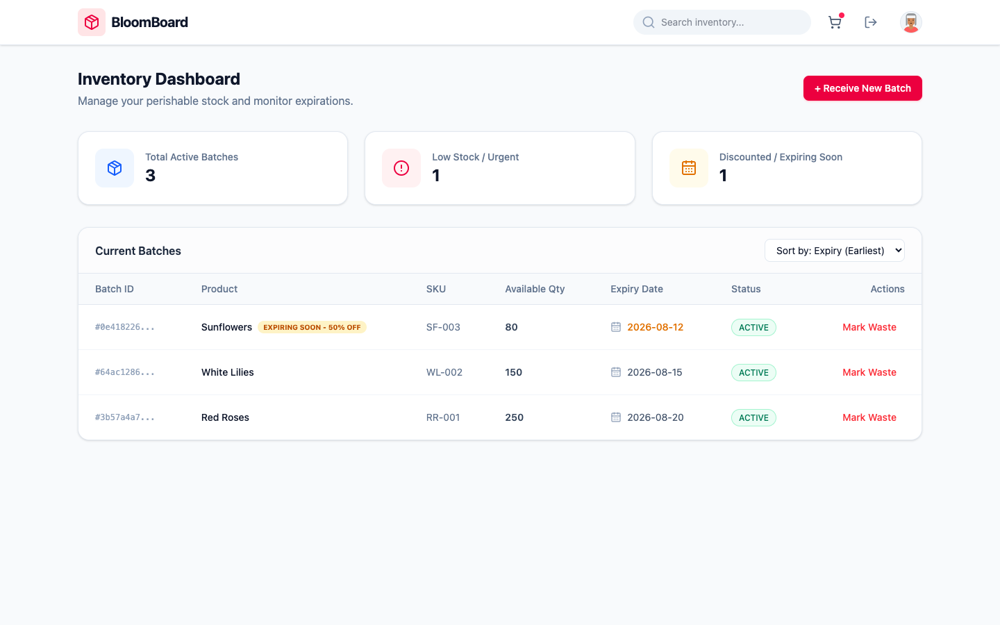
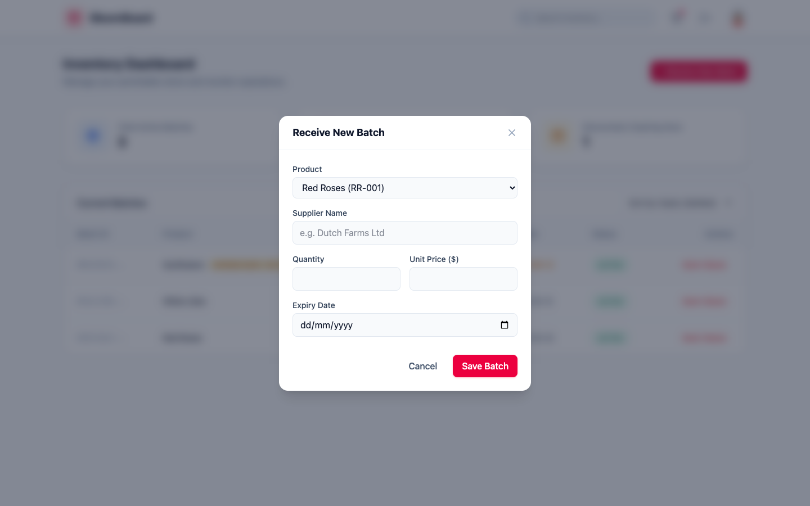

<p align="center">
  
</p>

<h1 align="center">🌸 BloomBoard</h1>

<p align="center">
  <strong>Perishable Inventory & Order Management for Modern Florists</strong>
</p>

<p align="center">
  
  
  
  
  
  
</p>

---

BloomBoard is a full-stack, production-ready inventory and order management platform designed specifically for florists who deal with **time-sensitive, perishable stock**. It solves the hard problems of floral retail: flowers expire, stock runs out, and customers need guarantees. BloomBoard handles all of this automatically.

## 📸 Screenshots

### Inventory Dashboard


The main dashboard shows your live inventory at a glance. Notice how the **Sunflowers** batch is automatically flagged as "Expiring Soon – 50% Off" because it expires within 48 hours. The three stat cards at the top give you an immediate operational picture.

### Receive New Batch


The "Receive New Batch" modal lets you log a new delivery in seconds. Select the product from your catalog, enter the supplier, quantity, unit price, and expiry date — all validated before hitting the API.

---

## ✨ Core Features

| Feature | Description |
|---|---|
| **FEFO Engine** | Allocates stock using First-Expired-First-Out logic, automatically using the oldest batches first to minimize waste |
| **Atomic Checkout** | Combines a PostgreSQL transaction with a Redis reservation in a single atomic operation — zero chance of overselling |
| **Dynamic Discounting** | The API automatically flags batches expiring within 48 hours as `isDiscounted: true`, surfaced in the UI as a high-visibility badge |
| **Waste Processing** | Securely discard expired or unsellable batches with a single click, setting quantity to zero and status to `DISCARDED` |
| **Delivery Scheduling** | Orders can include an optional delivery date, persisted atomically alongside the inventory allocation |
| **JWT Security** | Stateless authentication using Spring Security + JWTs. All endpoints require a valid bearer token |

---

## 🏗️ Architecture

```
┌─────────────────────────────────────────────────┐
│               React + Tailwind CSS              │
│         (Inventory Dashboard / Login UI)         │
└───────────────────────┬─────────────────────────┘
                        │ HTTP / REST
┌───────────────────────▼─────────────────────────┐
│           Spring Boot 3 (Port 8080)              │
│                                                  │
│  ┌─────────────┐  ┌────────────────────────────┐ │
│  │ AuthController│  │   InventoryController      │ │
│  │ (JWT Login) │  │   (Batches, Products)      │ │
│  └──────┬──────┘  └───────────┬────────────────┘ │
│         │                     │                  │
│  ┌──────▼─────────────────────▼────────────────┐ │
│  │           Service Layer                       │ │
│  │  InventoryService (FEFO) │ OrderService       │ │
│  │  ReservationService (Redis)                  │ │
│  └──────┬──────────────────────────────────────┘ │
│         │                                        │
│  ┌──────▼──────────────────────────────────────┐ │
│  │           Repository Layer (Spring Data JPA) │ │
│  └──────┬─────────────────────────┬────────────┘ │
│         │                         │              │
└─────────┼─────────────────────────┼──────────────┘
          │                         │
    ┌─────▼──────┐           ┌──────▼─────┐
    │ PostgreSQL  │           │    Redis   │
    │  (Flyway)  │           │ (Sessions) │
    └────────────┘           └────────────┘
```

### The FEFO Inventory Engine

When a customer checks out, `InventoryService.allocate()` runs through all active batches for a given product **sorted by expiry date ascending**. It distributes the required quantity across batches in order, ensuring the oldest flowers are sold first. This is the core business logic that differentiates BloomBoard from a simple stock counter.

```
Requested: 35 units of Red Roses

Batch A (expires Aug 12): 20 units → ALLOCATES ALL 20
Batch B (expires Aug 20): 15 units → ALLOCATES REMAINING 15

Result: Order fulfilled from 2 batches, oldest stock used first.
```

### Atomic Checkout with Redis

To prevent two customers from buying the last 10 units simultaneously, the checkout flow uses a two-phase approach:
1. **Reserve** (Redis, TTL = 15 min): A temporary lock on the quantity is placed in Redis.
2. **Confirm** (PostgreSQL): On successful payment/confirmation, the reservation is redeemed and the DB is updated in a single `@Transactional` call.

This prevents overselling while allowing reservations to auto-expire if a customer abandons their cart.

---

## 🗄️ Database Schema

Managed via **Flyway** migrations:

```sql
-- V1: Core Schema
products (id, name, sku, description)
batches  (id, product_id, supplier_name, quantity_initial, quantity_available,
          purchase_price, expiry_date, status, received_at)
bouquets (id, name, description, base_price)
orders   (id, customer_email, status, total_amount, delivery_date, created_at)
order_items (id, order_id, bouquet_id, quantity, unit_price)

-- V2: Authentication
users (id, username, password, role, created_at)

-- V3: Delivery Scheduling
ALTER TABLE orders ADD COLUMN delivery_date TIMESTAMP;
```

---

## 🛠️ Tech Stack

**Backend**
- Java 21 + Spring Boot 3.x
- Spring Security + JWT (stateless, `OncePerRequestFilter`)
- Spring Data JPA + Hibernate
- Flyway for database migrations
- Redis (`spring-data-redis`) for reservations
- Lombok for boilerplate reduction
- Jakarta Validation (`@Valid`)

**Frontend**
- React 18 + Vite
- Tailwind CSS v4
- Lucide React (icons)
- Native `fetch` API for REST calls

**Infrastructure**
- PostgreSQL 15+ (via Docker or local)
- Redis 7+ (via Docker or local)
- Testcontainers (ephemeral Postgres + Redis for tests)

---

## 🚀 Getting Started

### Prerequisites
- Java 21 (Homebrew: `brew install openjdk@21`)
- Node.js 18+
- Docker (for PostgreSQL & Redis)

### 1. Start Infrastructure

```bash
# Start PostgreSQL
docker run -d --name bloomboard-postgres \
  -e POSTGRES_USER=myuser \
  -e POSTGRES_PASSWORD=mypassword \
  -e POSTGRES_DB=bloomboard \
  -p 5432:5432 postgres

# Start Redis
docker run -d --name bloomboard-redis \
  -p 6379:6379 redis
```

### 2. Run the Backend

```bash
cd backend

export JAVA_HOME="/opt/homebrew/opt/openjdk@21"
export PATH="$JAVA_HOME/bin:$PATH"

./mvnw spring-boot:run
```

The server starts on **http://localhost:8080**. Flyway automatically runs all 3 migrations and seeds the `admin` user.

### 3. Run the Frontend

```bash
cd frontend
npm install
npm run dev
```

The UI is available at **http://localhost:5173**.

### 4. Log In

| Field | Value |
|---|---|
| Username | `admin` |
| Password | `password` |

---

## 🔌 API Reference

All endpoints (except `/api/auth/login`) require a `Bearer <token>` header.

### Authentication

| Method | Endpoint | Description |
|---|---|---|
| `POST` | `/api/auth/login` | Authenticate and receive a JWT |

**Request Body:**
```json
{
  "username": "admin",
  "password": "password"
}
```
**Response:**
```json
{
  "token": "eyJhbGci...",
  "username": "admin",
  "role": "ROLE_ADMIN"
}
```

---

### Inventory

| Method | Endpoint | Description |
|---|---|---|
| `GET` | `/api/inventory/batches` | List all active batches (with `isDiscounted` flag) |
| `POST` | `/api/inventory/batches` | Receive a new batch of stock |
| `GET` | `/api/inventory/products` | List all products |
| `POST` | `/api/inventory/batches/{id}/waste` | Mark a batch as wasted/discarded |

**Receive Batch Request:**
```json
{
  "productId": "11111111-1111-1111-1111-111111111111",
  "supplierName": "Dutch Farms Ltd",
  "quantity": 250,
  "purchasePrice": 1.50,
  "expiryDate": "2026-08-20T00:00:00"
}
```

**Batch Response (with dynamic discount):**
```json
{
  "id": "3b57a4a7-...",
  "product": "Red Roses",
  "sku": "RR-001",
  "quantity": 250,
  "expiryDate": "2026-08-20",
  "status": "ACTIVE",
  "isDiscounted": false
}
```

---

### Orders

| Method | Endpoint | Description |
|---|---|---|
| `POST` | `/api/v1/orders/checkout` | Place an order (FEFO allocation + atomic reservation) |

**Checkout Request:**
```json
{
  "cartId": "cart-uuid",
  "customerEmail": "jane@example.com",
  "deliveryDate": "2026-08-15T10:00:00",
  "items": [
    {
      "bouquetId": "bouquet-uuid",
      "productId": "product-uuid",
      "quantity": 10,
      "unitPrice": 15.00
    }
  ]
}
```

---

## 🧪 Running Tests

```bash
cd backend
./mvnw clean test
```

The test suite uses **Testcontainers** to spin up ephemeral PostgreSQL and Redis instances — no local infrastructure required. All 7 tests pass:

- `BloomBoardApplicationTests` — Spring context loads
- `InventoryServiceTest` — FEFO allocation, waste batch, out-of-stock handling
- `AuthControllerTest` — JWT generation and login flows
- `InventoryControllerTest` — Controller unit tests

```
Tests run: 7, Failures: 0, Errors: 0, Skipped: 0
BUILD SUCCESS
```

---

## 📁 Project Structure

```
BloomBoard/
├── backend/
│   ├── src/main/java/com/bloomboard/backend/
│   │   ├── controller/          # REST controllers + DTOs
│   │   │   └── dto/             # ApiCheckoutRequest, BatchResponse, etc.
│   │   ├── domain/              # JPA Entities: Batch, Order, Product, User
│   │   ├── repository/          # Spring Data JPA repositories
│   │   ├── service/             # InventoryService (FEFO), OrderService, ReservationService
│   │   │   └── dto/             # CheckoutRequest, CheckoutItem, AllocationResult
│   │   └── security/            # SecurityConfig, JwtUtil, JwtAuthFilter
│   ├── src/main/resources/
│   │   ├── application.yml      # DB + Redis config
│   │   └── db/migration/        # V1, V2, V3 Flyway migrations
│   └── src/test/                # Unit + Integration tests
├── frontend/
│   └── src/
│       ├── App.jsx              # Main dashboard (inventory table, stats, batch modal)
│       └── Login.jsx            # JWT login form
└── docs/
    └── images/                  # Screenshots used in this README
```

---

## 📄 License

MIT License — built with ❤️ for florists everywhere.
